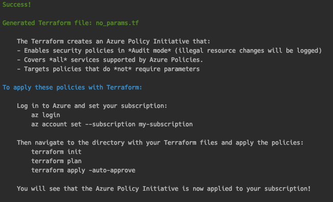

# Cloud Guardrails

Cloud Guardrails allows you to rapidly cherry-pick security guardrails in the form of Azure Policy Initiatives.


[](https://pepy.tech/project/cloud-guardrails)
[](https://twitter.com/kmcquade3)

# Table of contents

- [Overview](#overview)
- [Cheatsheet](#cheatsheet)
- [Installation](#installation)
- [Tutorial](#tutorial)
  - [Example: No Parameters](#example-no-parameters)
  - [Example: Single Service](#example-single-service)
  - [Example: Parameters](#example-parameters)
- [Policy Characteristics and Support Statuses](#policy-characteristics-and-support-statuses)
- [Contributing](#contributing)
  - [Setup](#setup)
  - [Other tasks](#other-tasks)
- [Authors and Contributors](#authors-and-contributors)
- [References](#references)

# Overview

[Azure Policies](https://docs.microsoft.com/en-us/azure/governance/policy/overview) - similar to [AWS Service Control Policies (SCPs)](https://docs.aws.amazon.com/organizations/latest/userguide/orgs_manage_policies_scps.html) - allows Azure customers to enforce organizational standards and enforce security policies at scale. You can use Azure Policies to evaluate the overall state of your environment, and drill down to the security status per resource and per policy. **For example, you can prevent users from creating any unencrypted resources or security group rules that allow SSH/RDP Access to 0.0.0.0/0**.

Azure provides **400+ built-in security policies**. This presents an incredible opportunity for customers who want to enforce preventative security guardrails from the start. However, deciding which of the 400+ built-in policies you want to enforce, and which stages you want to roll them out in can be a bit intimidating at the start.

To help maximize coverage and ease the rollout process, I created this tool so that you can:

* **Cherry-pick and bulk-select the security policies you want** according to your specific criteria
* Enforce low-friction policies within **minutes**
* Easily roll back policies that you don't want

# Cheatsheet

### Quick start

```bash
# Install Terraform (prerequisite)
brew install tfenv
tfenv install 0.12.28

# Install via pip
pip3 install cloud-guardrails --user

# Generate files for Guardrails that do not require parameters
cloud-guardrails generate-terraform --no-params --subscription example

# Log into Azure and set your subscription
az login
az account set --subscription example

# Apply the policies
terraform init
terraform plan
terraform apply -auto-approve
```

### Writing Policies

```bash
# No Parameters
cloud-guardrails generate-terraform --no-params --subscription example

# Optional Parameters (i.e., all the policies have default parameter values)
cloud-guardrails generate-terraform --params-optional --subscription example

# Required Parameters
cloud-guardrails generate-terraform --params-required \
    --service Kubernetes \
    --subscription example

# Create Config file
cloud-guardrails create-config-file --output config.yml

# Create Parameters file
cloud-guardrails create-parameters-file --output parameters.yml
```

### Querying Policy Data

```
# list-services: List all the services supported by Azure built-in Policies
cloud-guardrails list-services

# list-policies: List all the existing built-in Azure Policies
cloud-guardrails list-policies --service "Kubernetes" --all-policies
cloud-guardrails list-policies --service "Kubernetes" --no-params
cloud-guardrails list-policies --service "Kubernetes" --audit-only

# describe-policy: Describe a specific policy based on display name or the short policy ID
cloud-guardrails describe-policy --id 7c1b1214-f927-48bf-8882-84f0af6588b1
cloud-guardrails describe-policy --name "Storage accounts should use customer-managed key for encryption"
```

# Installation

#### Option 1: Homebrew

```bash
brew tap salesforce/cloud-guardrails https://github.com/salesforce/cloud-guardrails
brew install cloud-guardrails
```

#### Option 2: Pip3

```bash
pip3 install --user cloud-guardrails
```

#### Terraform

* Install Terraform if you haven't already. I recommend using [tfenv](https://github.com/tfutils/tfenv), a Terraform version manager:

```bash
brew install tfenv
tfenv install 0.12.28
```

Now you can follow the rest of the tutorial.

# Tutorial

## Example: No Parameters

* First, log into Azure and set your subscription

```bash
az login
az account set --subscription my-subscription
```

* Then generate the Terraform files:

```bash
cloud-guardrails generate-terraform --no-params \
    --subscription example
```

* Navigate to the Terraform directory and apply the policies:

```bash
cd examples/terraform-demo/
terraform init
terraform plan
terraform apply -auto-approve
```

The output will look like this:

> 

It will generate a file called `no_params.tf`. The file contents will look like this: [examples/terraform-demo-no-params/main.tf](examples/terraform-demo-no-params/no_params.tf).

## Example: Single Service

You can also generate policies for a single service. Consider the example below where we generate Terraform for Key Vault only:

```bash
cloud-guardrails generate-terraform --no-params \
    --service "Key Vault" \
    --subscription example
```

<details>
<summary>Click to expand!</summary>
<p>

```hcl
locals {
  name_no_params = "example_NP_Audit"
  subscription_name_no_params = "example"
  management_group_no_params = ""
  enforcement_mode_no_params = false
  policy_ids_no_params = [
    # -----------------------------------------------------------------------------------------------------------------
    # Key Vault
    # -----------------------------------------------------------------------------------------------------------------
    "c39ba22d-4428-4149-b981-70acb31fc383", # Azure Key Vault Managed HSM should have purge protection enabled
    "0b60c0b2-2dc2-4e1c-b5c9-abbed971de53", # Key vaults should have purge protection enabled
    "1e66c121-a66a-4b1f-9b83-0fd99bf0fc2d", # Key vaults should have soft delete enabled
    "55615ac9-af46-4a59-874e-391cc3dfb490", # Firewall should be enabled on Key Vault
    "152b15f7-8e1f-4c1f-ab71-8c010ba5dbc0", # Key Vault keys should have an expiration date
    "98728c90-32c7-4049-8429-847dc0f4fe37", # Key Vault secrets should have an expiration date
    "587c79fe-dd04-4a5e-9d0b-f89598c7261b", # Keys should be backed by a hardware security module (HSM)
    "5f0bc445-3935-4915-9981-011aa2b46147", # Private endpoint should be configured for Key Vault
    "75262d3e-ba4a-4f43-85f8-9f72c090e5e3", # Secrets should have content type set

  ]
}

# ---------------------------------------------------------------------------------------------------------------------
# Azure Policy name lookups:
# Because the policies are built-in, we can just look up their IDs by their names.
# ---------------------------------------------------------------------------------------------------------------------
data "azurerm_policy_definition" "no_params" {
  count        = length(local.policy_ids_no_params)
  name         = element(local.policy_ids_no_params, count.index)
}

locals {
  no_params_policy_definitions = flatten([tolist([
    for definition in data.azurerm_policy_definition.no_params.*.id :
    map("policyDefinitionId", definition)
    ])
  ])
}

# ---------------------------------------------------------------------------------------------------------------------
# Conditional data lookups: If the user supplies management group, look up the ID of the management group
# ---------------------------------------------------------------------------------------------------------------------
data "azurerm_management_group" "no_params" {
  count = local.management_group_no_params != "" ? 1 : 0
  display_name  = local.management_group_no_params
}

### If the user supplies subscription, look up the ID of the subscription
data "azurerm_subscriptions" "no_params" {
  count                 = local.subscription_name_no_params != "" ? 1 : 0
  display_name_contains = local.subscription_name_no_params
}

locals {
  no_params_scope = local.management_group_no_params != "" ? data.azurerm_management_group.no_params[0].id : element(data.azurerm_subscriptions.no_params[0].subscriptions.*.id, 0)
}

# ---------------------------------------------------------------------------------------------------------------------
# Policy Initiative
# ---------------------------------------------------------------------------------------------------------------------
resource "azurerm_policy_set_definition" "no_params" {
  name                  = local.name_no_params
  policy_type           = "Custom"
  display_name          = local.name_no_params
  description           = local.name_no_params
  management_group_name = local.management_group_no_params == "" ? null : local.management_group_no_params
  policy_definitions    = tostring(jsonencode(local.no_params_policy_definitions))
  metadata = tostring(jsonencode({
    category = local.name_no_params
  }))
}

# ---------------------------------------------------------------------------------------------------------------------
# Azure Policy Assignments
# Apply the Policy Initiative to the specified scope
# ---------------------------------------------------------------------------------------------------------------------
resource "azurerm_policy_assignment" "no_params" {
  name                 = local.name_no_params
  policy_definition_id = azurerm_policy_set_definition.no_params.id
  scope                = local.no_params_scope
  enforcement_mode     = local.enforcement_mode_no_params
}

# ---------------------------------------------------------------------------------------------------------------------
# Outputs
# ---------------------------------------------------------------------------------------------------------------------
output "no_params_policy_assignment_ids" {
  value       = azurerm_policy_assignment.no_params.id
  description = "The IDs of the Policy Assignments."
}

output "no_params_scope" {
  value       = local.no_params_scope
  description = "The target scope - either the management group or subscription, depending on which parameters were supplied"
}

output "no_params_policy_set_definition_id" {
  value       = azurerm_policy_set_definition.no_params.id
  description = "The ID of the Policy Set Definition."
}

output "no_params_count_of_policies_applied" {
  description = "The number of Policies applied as part of the Policy Initiative"
  value       = length(local.policy_ids_no_params)
}
```
</details>

## Example: Parameters

### Background and Motivation

Azure Parameters are similar to fields on a form - `name`, `address`, `city`, `state`. These parameters always stay the same, however their values change based on the individual filling out the form. Parameters work the same way when building policies. By including parameters in a policy definition, you can reuse that policy for different scenarios by using different values.

However, [the process that Microsoft lays out for managing Policy as Code workflows](https://docs.microsoft.com/en-us/azure/governance/policy/concepts/policy-as-code#create-and-update-policy-definitions) is less preferable to some, due to the amount of policy files and the lack of a single view of parameters. Their documentation suggests this file structure for laying out your policy files and parameters.

```
.
|
|- policies/  ________________________ # Root folder for policy resources
|  |- policy1/  ______________________ # Subfolder for a policy
|     |- policy.json _________________ # Policy definition
|     |- policy.parameters.json ______ # Policy definition of parameters
|     |- policy.rules.json ___________ # Policy rule
|     |- assign.<name1>.json _________ # Assignment 1 for this policy definition
|     |- assign.<name2>.json _________ # Assignment 2 for this policy definition
|  |- policy2/  ______________________ # Subfolder for a policy
|     |- policy.json _________________ # Policy definition
|     |- policy.parameters.json ______ # Policy definition of parameters
|     |- policy.rules.json ___________ # Policy rule
|     |- assign.<name1>.json _________ # Assignment 1 for this policy definition
|     |- assign.<name2>.json _________ # Assignment 2 for this policy definition
|
```

That's a lot of JSON, and a lot of clicks.

`cloud-guardrails` offers a more elegant solution. You can specify your paramters in the form of a YAML file. The YAML file allows you to modify the parameters per policy in a fine-grained manner. Additionally, you don't have to write the parameters file yourself! Just run the `create-parameters-file` command, and it will create the file for you. You just have to fill in the values like a form.

Let's take a tour.

### Parameters tutorial

* Generate the parameters file:

```bash
cloud-guardrails create-parameters-file \
    --optional-only \
    -o parameters-optional.yml
```

The generated `parameters-optional.yml` file will only contain policies that have parameters with default values. The policies are sorted by service for improved readability. Consider the snippet below from the Key Vault section:

```yaml
# ---------------------------------------------------------------------------------------------------------------------
# Key Vault
# ---------------------------------------------------------------------------------------------------------------------
Key Vault:
  "Resource logs in Key Vault should be enabled":
    effect: AuditIfNotExists  # Allowed: ["AuditIfNotExists", "Disabled"]
    requiredRetentionDays: 365

  "[Preview]: Certificates should be issued by the specified integrated certificate authority":
    allowedCAs:
        - DigiCert
        - GlobalSign # Allowed: ["DigiCert", "GlobalSign"]
    effect: audit  # Allowed: ["audit", "deny", "disabled"]

  "[Preview]: Certificates should have the specified maximum validity period":
    maximumValidityInMonths: 12
    effect: audit  # Allowed: ["audit", "deny", "disabled"]
```

Notice how some parameters only allow specific values. For example, the policy named `"Certificates should be issued by the specified integrated certificate authority"` has a parameter called `allowedCAs`. However, you can't just provide **any** value to that parameter - it has to be one of two allowed values. `cloud-guardrails` simplifies this process by including the allowed values in the comments - `# Allowed: ["DigiCert", "GlobalSign"]`.


* Now let's generate Terraform using this parameters file. Run the following command:

```bash
cloud-guardrails generate-terraform --params-optional \
    -s "Key Vault" \
    --subscription example \
    -p parameters-optional.yml
```

* Observe that the output will include the parameters that you supplied in your config file:

<details>
<summary>Click to expand!</summary>
<p>

```hcl
locals {
  name_example_PO_Audit = "example_PO_Audit"
  subscription_name_example_PO_Audit = "example"
  management_group_example_PO_Audit = ""
  category_example_PO_Audit = "Testing"
  enforcement_mode_example_PO_Audit = false
  policy_ids_example_PO_Audit = [
    # -----------------------------------------------------------------------------------------------------------------
    # Key Vault
    # -----------------------------------------------------------------------------------------------------------------
    "a2a5b911-5617-447e-a49e-59dbe0e0434b", # Resource logs in Azure Key Vault Managed HSM should be enabled
    "cf820ca0-f99e-4f3e-84fb-66e913812d21", # Resource logs in Key Vault should be enabled
    "8e826246-c976-48f6-b03e-619bb92b3d82", # Certificates should be issued by the specified integrated certificate authority
    "0a075868-4c26-42ef-914c-5bc007359560", # Certificates should have the specified maximum validity period
    "1151cede-290b-4ba0-8b38-0ad145ac888f", # Certificates should use allowed key types
    "bd78111f-4953-4367-9fd5-7e08808b54bf", # Certificates using elliptic curve cryptography should have allowed curve names
    "75c4f823-d65c-4f29-a733-01d0077fdbcb", # Keys should be the specified cryptographic type RSA or EC
    "ff25f3c8-b739-4538-9d07-3d6d25cfb255", # Keys using elliptic curve cryptography should have the specified curve names

  ]
  policy_definition_map = {
    "Resource logs in Azure Key Vault Managed HSM should be enabled" = "/providers/Microsoft.Authorization/policyDefinitions/a2a5b911-5617-447e-a49e-59dbe0e0434b",
    "Resource logs in Key Vault should be enabled" = "/providers/Microsoft.Authorization/policyDefinitions/cf820ca0-f99e-4f3e-84fb-66e913812d21",
    "Certificates should be issued by the specified integrated certificate authority" = "/providers/Microsoft.Authorization/policyDefinitions/8e826246-c976-48f6-b03e-619bb92b3d82",
    "Certificates should have the specified maximum validity period" = "/providers/Microsoft.Authorization/policyDefinitions/0a075868-4c26-42ef-914c-5bc007359560",
    "Certificates should use allowed key types" = "/providers/Microsoft.Authorization/policyDefinitions/1151cede-290b-4ba0-8b38-0ad145ac888f",
    "Certificates using elliptic curve cryptography should have allowed curve names" = "/providers/Microsoft.Authorization/policyDefinitions/bd78111f-4953-4367-9fd5-7e08808b54bf",
    "Keys should be the specified cryptographic type RSA or EC" = "/providers/Microsoft.Authorization/policyDefinitions/75c4f823-d65c-4f29-a733-01d0077fdbcb",
    "Keys using elliptic curve cryptography should have the specified curve names" = "/providers/Microsoft.Authorization/policyDefinitions/ff25f3c8-b739-4538-9d07-3d6d25cfb255",
    }
}

# ---------------------------------------------------------------------------------------------------------------------
# Conditional data lookups: If the user supplies management group, look up the ID of the management group
# ---------------------------------------------------------------------------------------------------------------------
data "azurerm_management_group" "example_PO_Audit" {
  count = local.management_group_example_PO_Audit != "" ? 1 : 0
  display_name  = local.management_group_example_PO_Audit
}

### If the user supplies subscription, look up the ID of the subscription
data "azurerm_subscriptions" "example_PO_Audit" {
  count                 = local.subscription_name_example_PO_Audit != "" ? 1 : 0
  display_name_contains = local.subscription_name_example_PO_Audit
}

locals {
  scope = local.management_group_example_PO_Audit != "" ? data.azurerm_management_group.example_PO_Audit[0].id : element(data.azurerm_subscriptions.example_PO_Audit[0].subscriptions.*.id, 0)
}

# ---------------------------------------------------------------------------------------------------------------------
# Azure Policy Definition Lookups
# ---------------------------------------------------------------------------------------------------------------------

data "azurerm_policy_definition" "example_PO_Audit_definition_lookups" {
  count = length(local.policy_ids_example_PO_Audit)
  name  = local.policy_ids_example_PO_Audit[count.index]
}

# ---------------------------------------------------------------------------------------------------------------------
# Azure Policy Initiative Definition
# ---------------------------------------------------------------------------------------------------------------------

resource "azurerm_policy_set_definition" "example_PO_Audit" {
  name                  = local.name_example_PO_Audit
  policy_type           = "Custom"
  display_name          = local.name_example_PO_Audit
  description           = local.name_example_PO_Audit
  management_group_name = local.management_group_example_PO_Audit == "" ? null : local.management_group_example_PO_Audit
  metadata = tostring(jsonencode({
    category = local.category_example_PO_Audit
  }))
  policy_definition_reference {
    policy_definition_id = lookup(local.policy_definition_map, "Resource logs in Azure Key Vault Managed HSM should be enabled")
    parameter_values = jsonencode({
        effect = { "value" : "AuditIfNotExists" }
        requiredRetentionDays = { "value" : "365" }
    })
    reference_id = null
  }

  policy_definition_reference {
    policy_definition_id = lookup(local.policy_definition_map, "Resource logs in Key Vault should be enabled")
    parameter_values = jsonencode({
        effect = { "value" : "AuditIfNotExists" }
        requiredRetentionDays = { "value" : "365" }
    })
    reference_id = null
  }

  policy_definition_reference {
    policy_definition_id = lookup(local.policy_definition_map, "Certificates should be issued by the specified integrated certificate authority")
    parameter_values = jsonencode({
        allowedCAs = { "value" : ["DigiCert", "GlobalSign"] }
        effect = { "value" : "audit" }
    })
    reference_id = null
  }

  policy_definition_reference {
    policy_definition_id = lookup(local.policy_definition_map, "Certificates should have the specified maximum validity period")
    parameter_values = jsonencode({
        maximumValidityInMonths = { "value" : 12 }
        effect = { "value" : "audit" }
    })
    reference_id = null
  }

  policy_definition_reference {
    policy_definition_id = lookup(local.policy_definition_map, "Certificates should use allowed key types")
    parameter_values = jsonencode({
        allowedKeyTypes = { "value" : ["RSA", "RSA-HSM"] }
        effect = { "value" : "audit" }
    })
    reference_id = null
  }

  policy_definition_reference {
    policy_definition_id = lookup(local.policy_definition_map, "Certificates using elliptic curve cryptography should have allowed curve names")
    parameter_values = jsonencode({
        allowedECNames = { "value" : ["P-256", "P-256K", "P-384", "P-521"] }
        effect = { "value" : "audit" }
    })
    reference_id = null
  }

  policy_definition_reference {
    policy_definition_id = lookup(local.policy_definition_map, "Keys should be the specified cryptographic type RSA or EC")
    parameter_values = jsonencode({
        allowedKeyTypes = { "value" : ["RSA", "RSA-HSM", "EC", "EC-HSM"] }
        effect = { "value" : "Audit" }
    })
    reference_id = null
  }

  policy_definition_reference {
    policy_definition_id = lookup(local.policy_definition_map, "Keys using elliptic curve cryptography should have the specified curve names")
    parameter_values = jsonencode({
        allowedECNames = { "value" : ["P-256", "P-256K", "P-384", "P-521"] }
        effect = { "value" : "Audit" }
    })
    reference_id = null
  }
}

# ---------------------------------------------------------------------------------------------------------------------
# Azure Policy Assignments
# Apply the Policy Initiative to the specified scope
# ---------------------------------------------------------------------------------------------------------------------
resource "azurerm_policy_assignment" "example_PO_Audit" {
  name                 = local.name_example_PO_Audit
  policy_definition_id = azurerm_policy_set_definition.example_PO_Audit.id
  scope                = local.scope
  enforcement_mode     = local.enforcement_mode_example_PO_Audit
}


# ---------------------------------------------------------------------------------------------------------------------
# Outputs
# ---------------------------------------------------------------------------------------------------------------------
output "example_PO_Audit_policy_assignment_ids" {
  value       = azurerm_policy_assignment.example_PO_Audit.id
  description = "The IDs of the Policy Assignments."
}

output "example_PO_Audit_scope" {
  value       = local.scope
  description = "The target scope - either the management group or subscription, depending on which parameters were supplied"
}

output "example_PO_Audit_policy_set_definition_id" {
  value       = azurerm_policy_set_definition.example_PO_Audit.id
  description = "The ID of the Policy Set Definition."
}
```
</details>

# Policy Characteristics and Support Statuses

<table>
<thead>
  <tr>
    <th><b><u>Characteristic</u></b></th>
    <th><b><u>Support</u></b></th>
    <th><b><u>Description</u></b></th>
  </tr>
</thead>
<tbody>
  <tr>
    <td colspan="3"><p align="center"><b><u>Parameters</u></b></p></td>
  </tr>
  <tr>
    <td>Policies with <b>No Parameters</b></td>
    <td>✅</td>
    <td>These policies do not require any parameters. These are the easiest policies to apply.</td>
  </tr>
  <tr>
    <td>Policies with <b>Optional Parameters</b></td>
    <td>✅</td>
    <td>These policies allow the use of parameters, but the parameters have default values. These are easy to apply at first, but you will likely want to adjust the parameters throughout the lifecycle.</td>
  </tr>
  <tr>
    <td>Policies with <b>Required Parameters</b></td>
    <td>✅</td>
    <td>These policies require parameters which do not have default values. While rollout is significantly less time consuming than the Azure recommended workflow, finding the best values for your environment requires careful thinking.</td>
  </tr>
  <tr>
    <td colspan="3"><p align="center"><b><u>Effects</u></b></p></td>
  </tr>
  <tr>
    <td>Policies with <b>"Deny" Effects</b></td>
    <td>✅</td>
    <td>   <br>These Policies block bad actions, acting as true guardrails.</td>
  </tr>
  <tr>
    <td>Policies with <b>"Audit" Effects</b></td>
    <td>✅</td>
    <td>These Policies do not actually prevent bad actions, even if “enforcement mode” is set to True - they just flag the bad actions.</td>
  </tr>
  <tr>
    <td>Policies with <b>"Deploy" Effects</b></td>
    <td>❌</td>
    <td>Some Azure Policies have <a href="https://docs.microsoft.com/en-us/azure/governance/policy/concepts/effects#deployifnotexists" target="_blank" rel="noopener noreferrer">DeployIfNotExists</a> effects, which create resources via an ARM Template when the condition is met. For example, the policy "<a href="https://portal.azure.com/#blade/Microsoft_Azure_Policy/PolicyDetailBlade/definitionId/%2Fproviders%2FMicrosoft.Authorization%2FpolicyDefinitions%2Fa9b99dd8-06c5-4317-8629-9d86a3c6e7d9" target="_blank" rel="noopener noreferrer">Deploy network watcher when virtual networks are created</a>" will create a resource group called networkWatcherRG.</td>
  </tr>
  <tr>
    <td>Policies with <b>"Modify" Effects</b></td>
    <td>❌</td>
    <td>Some Azure Policies have <a href="https://docs.microsoft.com/en-us/azure/governance/policy/concepts/effects" target="_blank" rel="noopener noreferrer">Policy Effects</a> that allow the modification of resources, such as the "<a href="https://docs.microsoft.com/en-us/azure/governance/policy/concepts/effects#modify" target="_blank" rel="noopener noreferrer">Modify</a>" or "<a href="https://docs.microsoft.com/en-us/azure/governance/policy/concepts/effects#append" target="_blank" rel="noopener noreferrer">Append</a>" effects.</td>
  </tr>
  <tr>
    <td colspan="3"><p align="center"><b><u>Built-in vs. Custom</u></b></p></td>
  </tr>
  <tr>
    <td><b>Built-in Policies</b></td>
    <td>✅</td>
    <td>Microsoft provides 400+ built-in policy definitions. cloud-guardrails leverages these Built-in Policy definitions so you can get rapidly started and maximize your coverage.</td>
  </tr>
  <tr>
    <td><b>Custom Policies</b></td>
    <td>❌</td>
    <td>cloud-guardrails does not support creation of Custom Policies. Consider leveraging Custom Policies after you have built out your process and workflow using cloud-guardrails.</td>
  </tr>
</tbody>
</table>


# Contributing

## Setup

* Set up the virtual environment

```bash
# Set up the virtual environment
python3 -m venv ./venv && source venv/bin/activate
pip3 install -r requirements.txt
```

* Build the package

```bash
# To build only
make build

# To build and install
make install

# To run tests
make test

# To clean local dev environment
make clean
```

## Other tasks

* Update with the latest Azure Compliance data

```bash
make update-data
```

* Update the policy summary tables

```bash
make update-policy-table
```

* Update the Azure Policy Git submodule and merge it

```bash
# Without merge
make update-submodule

# With merge
make update-submodule-with-merge
```

# Authors and Contributors

* [Kinnaird McQuade (@kmcquade3)](https://twitter.com/kmcquade3), Salesforce - Author

# References

* [Azure Policy Definition Structure](https://docs.microsoft.com/en-us/azure/governance/policy/concepts/definition-structure)
* [Azure Policy Parameters](https://docs.microsoft.com/en-us/azure/governance/policy/concepts/definition-structure#parameters)
* [Azure Policy Assignment Structure](https://docs.microsoft.com/en-us/azure/governance/policy/concepts/assignment-structure)
* [Authorization Schemas](https://github.com/Azure/azure-resource-manager-schemas/search?q=schemas+in%3Apath+filename%3AMicrosoft.Authorization.json)
